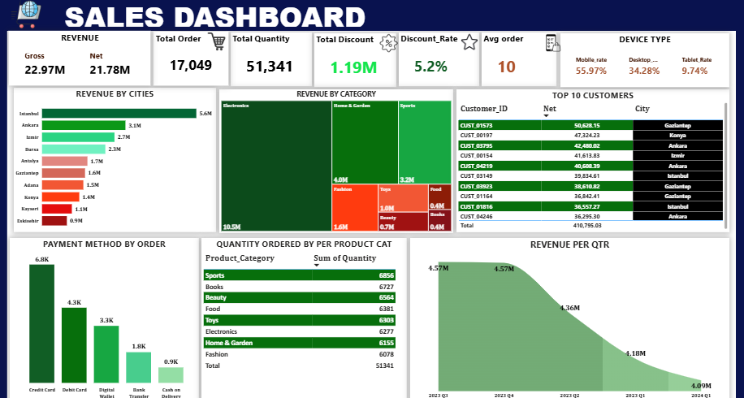
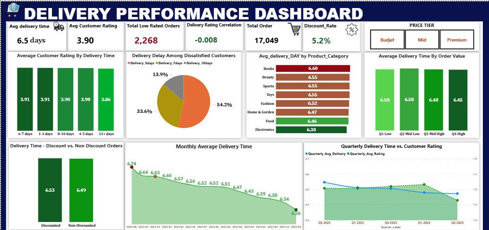

**🛒 Ecommerce Customer Behavior & Sales Analysis**

**📌 OVERVIEW**

This project delivers an end-to-end behavioral and commercial analysis of an ecommerce platform operating across 10 major Turkish cities. Using Power BI, four analytical dashboards were developed to surface actionable insights across the customer lifecycle — from acquisition and purchasing behavior, through pricing strategy, to fulfilment performance.

**ATTRIBUTES**

**Records** 17,049 orders 

**Customers**  5,000 unique customers 

**Geography**  10 cities Istanbul, Ankara, Izmir, Bursa, Adana, Antalya, Gaziantep, Konya, Kayseri, Eskişehir

**Time Period**  January 2023 – March 2024

**Features**  18 columns including demographics, transaction data, session behavior, delivery, and ratings

** 🛠 Tools Used**

1. Power BI

2. DAX 

**📊 DASHBORD & KEY FINDINGS**
1. Customer Churn & Behavior
**Churn Rate: 37.1% | Active Customers: 3,143 | At-Risk: 699**

   **INSIGHT**
   
The platform is experiencing significant customer attrition. Of 5,000 total customers, **1,857 have churned** (defined as inactive for 131+ days). An additional **699 active customers** — representing 22.2% of the active base — fall within the 90–131 day idle window, placing total churn exposure near 51% of the full customer base. Single-purchase customers are the highest churn risk. Converting a first-time buyer into a repeat customer is the single most impactful retention lever available. Geographic Concentration: Istanbul (484), Ankara (283), and Izmir (215) account for the three highest volumes of churned customers — cities that also generate the most revenue, making retention in these markets a top priority. Trend: Monthly churn declined from a peak of 335 (October 2023) to 65 (January 2023 cohort), reflecting cohort exhaustion rather than a genuine retention improvement.

2. Sales Performance
**Gross Revenue: $22.97M | Net Revenue: $21.78M | Total Orders: 17,049**

   **INISGHT**
   
  Electronics alone generates **48.1% of net revenue**, yet unit quantity sold (6,277) is among the lowest across all categories. Revenue dominance is driven entirely by high unit price, not volume — a concentration risk that warrants diversification. Revenue declined **10.5% from peak** to Q1 2024, a trend that correlates with the compounding effect of customer churn. All eight product categories carries a near-identical unit volumes **(6,078–6,856 units)**, meaning category revenue differences are entirely a function of unit price.

3.Price Optimization 
**Electronics Revenue Share: 48.1% | Average Unit Price: $448 | Discount Rate: 5.2%**

**INSIGHT**

Demand across nearly all categories is price-inelastic. Sports is the only category showing meaningful positive sensitivity (0.13), where modest price reductions may generate measurable volume uplift. Electronics is fully price-inelastic (sensitivity index: 0.00) with an average unit price of $1,767 — discounting this category produces zero quantity uplift. **Rating vs. Price Spread:** Customer ratings are broadly consistent across price tiers (3.88–3.91 average). However, Home & Garden shows a notable negative spread of –0.31, meaning budget-tier customers rate it higher than premium-tier customers — a signal of unmet value expectations at higher price points.

4. Delivery Performance
**Avg Delivery Time: 6.5 Days | Avg Customer Rating: 3.90 | Delivery-Rating Correlation: -0.008**

**INSIGHT**

Monthly average delivery time declined from **6.74 days (August 2023)** to **6.26 days (February 2024)**, demonstrating consistent operational improvement. **54.2% of dissatisfied customers received their orders within 5 days. ** Delivery speed is not the root cause of low ratings. The 2,268 low-rated orders are driven by factors unrelated to logistics — most likely product quality, inaccurate descriptions, or post-purchase service gaps.

**💡 Strategic Recommendations**

 **Customer Retention**
 * **Deploy a Second-Purchase Campaign** targeting single-order customers within 30 days of their first purchase.

 * **Activate a win-back sequence for the 699 at-risk customers** before they cross the 131-day churn threshold. A/B test discount-led vs. content-led approaches.

 *  **Build a tiered loyalty programme** to migrate low-spend customers into higher-value tiers, where churn rates fall to 23–29%.

   
**Sales & Revenue**

* **Diversify revenue beyond Electronics.** A single category contributing 48.1% of revenue represents significant concentration risk. Invest in scaling Home & Garden and Sports through targeted promotion and assortment expansion.

*  **Optimise the mobile experience** as a primary commercial priority, given that 55.97% of all sessions occur on mobile devices.

**Pricing**

* **Eliminate blanket discounts on Electronics.** Zero quantity uplift under high-discount conditions means promotional spend in this category erodes margin without generating volume. Reserve Electronics discounts for strategic acquisition purposes only.
  
* **Concentrate discount budgets in Books, Food, and Beauty**, where high-discount conditions drive uplift of 1.2–1.6 additional units per transaction.

**Delivery & Customer Experience**

*  **Redirect investment away from delivery speed improvements.** The –0.008 correlation and the finding that 54.2% of dissatisfied customers received orders within 5 days confirm speed is not the satisfaction driver.

*  **Set a sub-6.3 day delivery benchmark** across all categories as the next operational target, with particular focus on Books (currently 6.60 days).

⭐If you found this project insightful or would like to collaborate, feel free to connect with me on LinkedIn at Emmanuel Samuel or explore more of my work here.
   
