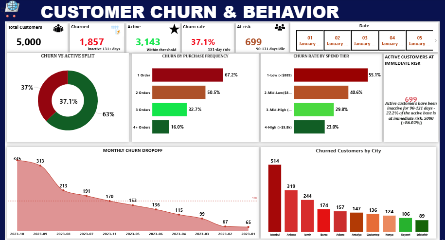

**🛒 Ecommerce Customer Behavior & Sales Analysis**

**OVERVIEW**

This project delivers an end-to-end behavioral and commercial analysis of an ecommerce platform operating across 10 major Turkish cities. Using Power BI, four analytical dashboards were developed to surface actionable insights across the customer lifecycle — from acquisition and purchasing behavior, through pricing strategy, to fulfilment performance.

**ATTRIBUTES**

**Records** 17,049 orders 
**Customers**  5,000 unique customers 
**Geography**  10 cities (Istanbul, Ankara, Izmir, Bursa, Adana, Antalya, Gaziantep, Konya, Kayseri, Eskişehir
**Time Period**  January 2023 – March 2024
**Features**  18 columns including demographics, transaction data, session behavior, delivery, and ratings

**DASHBORD & KEY FINDINGS**
1. Customer Churn & Behavior
**Churn Rate: 37.1% | Active Customers: 3,143 | At-Risk: 699**

   
