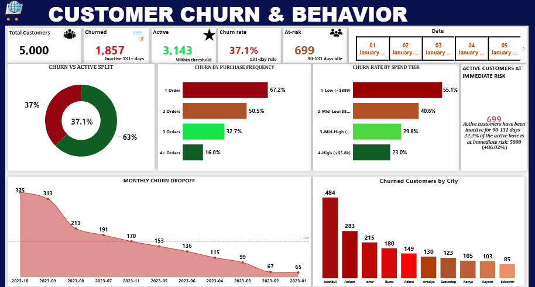

**🛒 Ecommerce Customer Behavior & Sales Analysis**

**OVERVIEW**

This project delivers an end-to-end behavioral and commercial analysis of an ecommerce platform operating across 10 major Turkish cities. Using Power BI, four analytical dashboards were developed to surface actionable insights across the customer lifecycle — from acquisition and purchasing behavior, through pricing strategy, to fulfilment performance.

**ATTRIBUTES**

**Records** 17,049 orders 
**Customers**  5,000 unique customers 
**Geography**  10 cities (Istanbul, Ankara, Izmir, Bursa, Adana, Antalya, Gaziantep, Konya, Kayseri, Eskişehir
**Time Period**  January 2023 – March 2024
**Features**  18 columns including demographics, transaction data, session behavior, delivery, and ratings

**DASHBORD & KEY FINDINGS**
1. Customer Churn & Behavior
**Churn Rate: 37.1% | Active Customers: 3,143 | At-Risk: 699**

   **INSIGHT**
   
The platform is experiencing significant customer attrition. Of 5,000 total customers, **1,857 have churned** (defined as inactive for 131+ days). An additional **699 active customers** — representing 22.2% of the active base — fall within the 90–131 day idle window, placing total churn exposure near 51% of the full customer base.Single-purchase customers are the highest churn risk. Converting a first-time buyer into a repeat customer is the single most impactful retention lever available.Geographic Concentration: Istanbul (484), Ankara (283), and Izmir (215) account for the three highest volumes of churned customers — cities that also generate the most revenue, making retention in these markets a top priority.Trend: Monthly churn declined from a peak of 335 (October 2023) to 65 (January 2023 cohort), reflecting cohort exhaustion rather than a genuine retention improvement.

